# MacKey (v1.0.2) — Bộ gõ Tiếng Việt Hiện Đại cho macOS

<p align="center">
  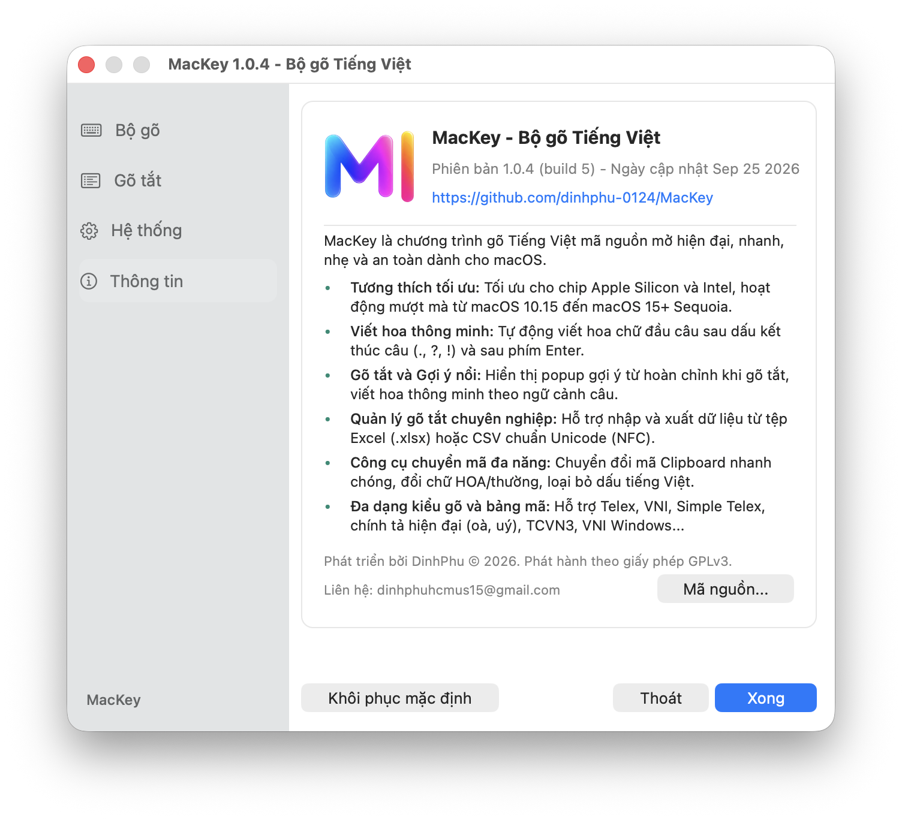
</p>

<p align="center">
  <a href="https://github.com/dinhphu-0124/MacKey/releases/latest"></a>
  <a href="https://github.com/dinhphu-0124/MacKey/releases"></a>
  <a href="#"></a>
  <a href="https://www.gnu.org/licenses/gpl-3.0"></a>
</p>

<p align="center">
  <a href="https://github.com/dinhphu-0124/MacKey/releases/latest/download/MacKey-1.0.3.dmg">
    
  </a>
  <br/>
  <sub>Tương thích hoàn hảo với chip <b>Apple Silicon (M1/M2/M3/M4)</b> và <b>Intel</b> từ macOS 10.15 Catalina đến <b>macOS 15+ Sequoia</b></sub>
</p>

---

## 📖 Mục lục

1. [🌟 Tính năng nổi bật](#-tính-năng-nổi-bật)
2. [📸 Tổng quan giao diện & Chức năng](#-tổng-quan-giao-diện--chức-năng)
   - [Menu thanh trạng thái (Menu Bar)](#1-menu-thanh-trạng-thái-menu-bar)
   - [Bảng điều khiển chính (Dashboard)](#2-bảng-điều-khiển-chính-dashboard)
   - [Quản lý gõ tắt chuyên nghiệp (Macro)](#3-quản-lý-gõ-tắt-chuyên-nghiệp-macro)
   - [Công cụ chuyển mã văn bản (Convert Tool)](#4-công-cụ-chuyển-mã-văn-bản-convert-tool)
   - [Kiểm tra cập nhật tự động từ GitHub](#5-kiểm-tra-cập-nhật-tự-động-từ-github)
3. [📥 Hướng dẫn cài đặt & Cấp quyền chi tiết (Có hình ảnh)](#-hướng-dẫn-cài-đặt--cấp-quyền-chi-tiết)
   - [Bước 1: Tải về và cài đặt từ file DMG](#bước-1-tải-về-và-cài-đặt-từ-file-dmg)
   - [Bước 2: Mở ứng dụng lần đầu (Vượt Gatekeeper)](#bước-2-mở-ứng-dụng-lần-đầu-vượt-gatekeeper)
   - [Bước 3: Cấp quyền Trợ năng (Accessibility)](#bước-3-cấp-quyền-trợ-năng-accessibility---bắt-buộc)
   - [Bước 4: Bắt đầu gõ tiếng Việt](#bước-4-bắt-đầu-gõ-tiếng-việt)
4. [⌨️ Các kiểu gõ & Bảng mã hỗ trợ](#️-các-kiểu-gõ--bảng-mã-hỗ-trợ)
5. [🔍 Xử lý sự cố thường gặp (FAQ)](#-xử-lý-sự-cố-thường-gặp)
6. [🗑️ Hướng dẫn gỡ cài đặt sạch sẽ](#️-hướng-dẫn-gỡ-cài-đặt-sạch-sẽ)
7. [📜 Giấy phép & Tác giả](#-giấy-phép--tác-giả)

---

## 🌟 Tính năng nổi bật

* 🧠 **Viết hoa thông minh:** Tự động viết hoa chữ cái đầu tiên sau các dấu kết thúc câu (`.`, `?`, `!`), không tự ý viết hoa khi mở app hay chuyển ô nhập, giữ phím thường tự nhiên khi gõ.
* ⚡ **Giao diện hiện đại chuẩn macOS:** Thiết kế phân cụm theo dạng thẻ card bo tròn sắc nét, hỗ trợ tự động Dark Mode và Light Mode, chuẩn Apple Human Interface Guidelines.
* 📝 **Quản lý gõ tắt ưu việt:**
  - Nhập danh sách từ Excel (`.xlsx`) hoặc tệp `.csv`.
  - Xuất danh sách ra Excel / CSV chuẩn hoá Unicode Dựng Sẵn (NFC), mở trên mọi máy tính và phiên bản Microsoft Excel không bao giờ bị lỗi font.
  - Nút **"Thêm mới"** nhanh chóng, huy hiệu đếm số lượng từ tắt hiện có và nút thùng rác xoá an toàn.
* 🔄 **Cập nhật trực tiếp từ GitHub Releases:** Đối chiếu phiên bản qua GitHub Releases API. Khi có bản mới, bạn chỉ cần bấm **"Cập nhật ngay"** để tải file `.dmg` về máy.
* 🚀 **Universal 2 siêu nhẹ:** Biên dịch tối ưu chạy gốc (Native) cho cả Apple Silicon (`arm64`) và Intel (`x86_64`), tiêu thụ cực ít tài nguyên RAM và pin.
* 🛡️ **Minh bạch & An toàn:** 100% mã nguồn mở GPLv3, không chứa mã theo dõi thao tác phím (keylogger), tôn trọng tuyệt đối quyền riêng tư.

> [!WARNING]
> **Tránh xung đột bộ gõ:** Khi sử dụng MacKey, hãy tắt hoặc xoá các bộ gõ tiếng Việt mặc định khác của macOS (như *Vietnamese Simple Telex* trong Cài đặt bàn phím) hoặc tắt EVKey để tránh tình trạng hai bộ gõ cùng xử lý phím gây nhảy chữ.

---

## 📸 Tổng quan giao diện & Chức năng

### 1. Menu thanh trạng thái (Menu Bar)
Biểu tượng của MacKey hiển thị trực tiếp trên thanh menu góc trên màn hình:
* **Chữ V (màu đỏ):** Đang bật chế độ gõ Tiếng Việt.
* **Chữ E (màu xám):** Đang ở chế độ gõ Tiếng Anh.

Bấm chuột vào biểu tượng để mở menu thao tác nhanh:

<p align="center">
  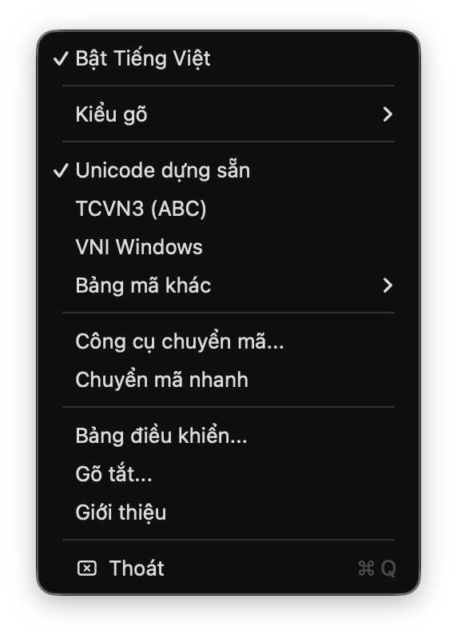
</p>

* Bật/tắt nhanh Tiếng Việt (hoặc bấm phím tắt nhanh).
* Chọn kiểu gõ: **Telex**, **VNI**, **Simple Telex**.
* Chọn nhanh bảng mã: **Unicode dựng sẵn**, **TCVN3 (ABC)**, **VNI Windows**...
* Mở nhanh **Công cụ chuyển mã...**, **Bảng điều khiển...**, **Gõ tắt...**, **Giới thiệu**.

---

### 2. Bảng điều khiển chính (Dashboard)

Giao diện Bảng điều khiển được tổ chức khoa học thành 4 tab chức năng:

#### Tab "Bộ gõ" — Tinh chỉnh engine gõ tiếng Việt
<p align="center">
  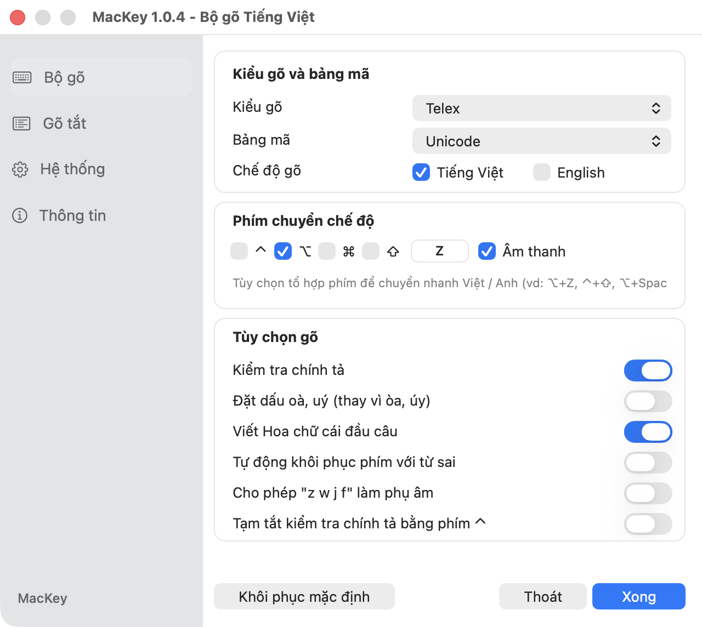
</p>

* **Kiểu gõ & Bảng mã:** Tuỳ chọn kiểu gõ phổ biến (Telex, VNI) và bảng mã xuất văn bản.
* **Phím chuyển chế độ (Switch Key):** Thiết lập tổ hợp phím đổi ngôn ngữ nhanh (ví dụ: `⌥ Option + Z`, `⌃ Control + Space`, `⌘ Command + ⇧ Shift`...) kèm tuỳ chọn âm thanh báo.
* **Tùy chọn gõ nâng cao:**
  - Bật/tắt kiểm tra chính tả thời gian thực (tạm tắt nhanh bằng giữ phím `⌃ Control`).
  - Hỗ trợ chuẩn chính tả hiện đại: **Đặt dấu oà, uý** (thay vì kiểu cũ *òa, úy*).
  - Tự động khôi phục phím gốc khi phát hiện từ sai chính tả.
  - Cho phép dùng `z, w, j, f` làm phụ âm độc lập.

#### Tab "Gõ tắt" — Cấu hình mở rộng & Tốc ký
<p align="center">
  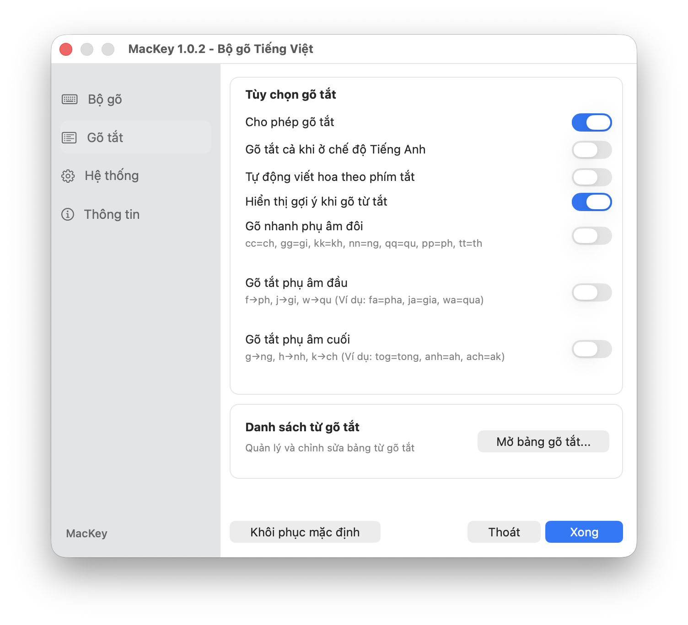
</p>

* **Cho phép gõ tắt:** Bật/tắt toàn bộ tính năng viết tắt.
* **Gõ tắt cả khi ở chế độ Tiếng Anh:** Giúp bạn gõ từ viết tắt bất kỳ lúc nào.
* **Tự động viết hoa theo phím tắt:** Gõ `Btw` → ra *By the way*, gõ `BTW` → ra *BY THE WAY*.
* **Hiển thị gợi ý khi gõ từ tắt:** Tự động hiển thị bong bóng gợi ý từ hoàn chỉnh nổi ngay trên con trỏ chuột khi đang gõ từ tắt.
* **Gõ nhanh phụ âm đôi:** `cc` → `ch`, `gg` → `gi`, `kk` → `kh`, `nn` → `ng`, `qq` → `qu`, `pp` → `ph`, `tt` → `th`.
* **Gõ tắt phụ âm đầu/cuối:** Viết nhanh `f` → `ph`, `j` → `gi`, `w` → `qu`, `g` → `ng`, `h` → `nh`...
* Nút **"Mở bảng gõ tắt..."** để quản lý danh sách từ tắt chi tiết.

#### Tab "Hệ thống" — Tùy chọn hệ thống & Tương thích
<p align="center">
  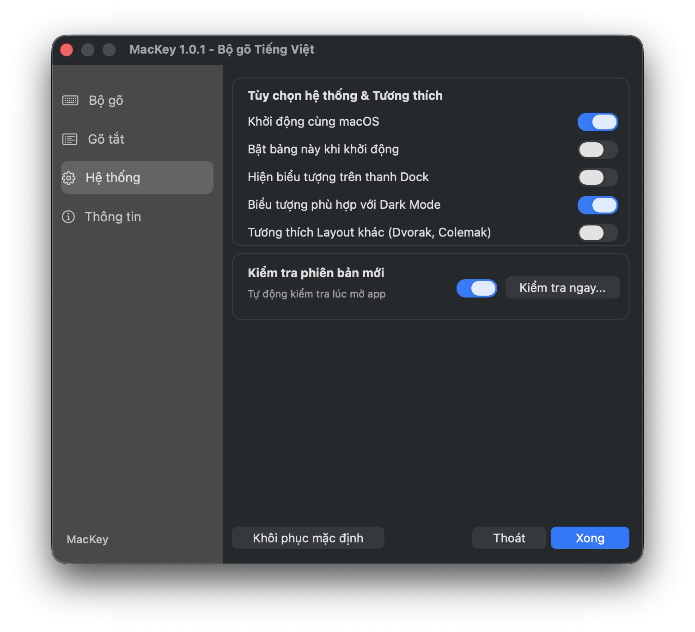
</p>

* **Khởi động cùng macOS:** Đảm bảo bộ gõ luôn chạy tự động mỗi khi mở máy.
* **Tùy chọn hiển thị:** Hiện/ẩn cửa sổ khi khởi động, ẩn icon thanh Dock.
* **Tương thích layout khác:** Hỗ trợ người dùng bàn phím bố cục **Dvorak**, **Colemak**...
* **Kiểm tra phiên bản mới:** Tự động kiểm tra bản cập nhật lúc mở ứng dụng.

---

### 3. Quản lý gõ tắt chuyên nghiệp (Macro)

Cửa sổ "Thiết lập gõ tắt" được thiết kế tối ưu với khả năng co giãn linh hoạt:

<p align="center">
  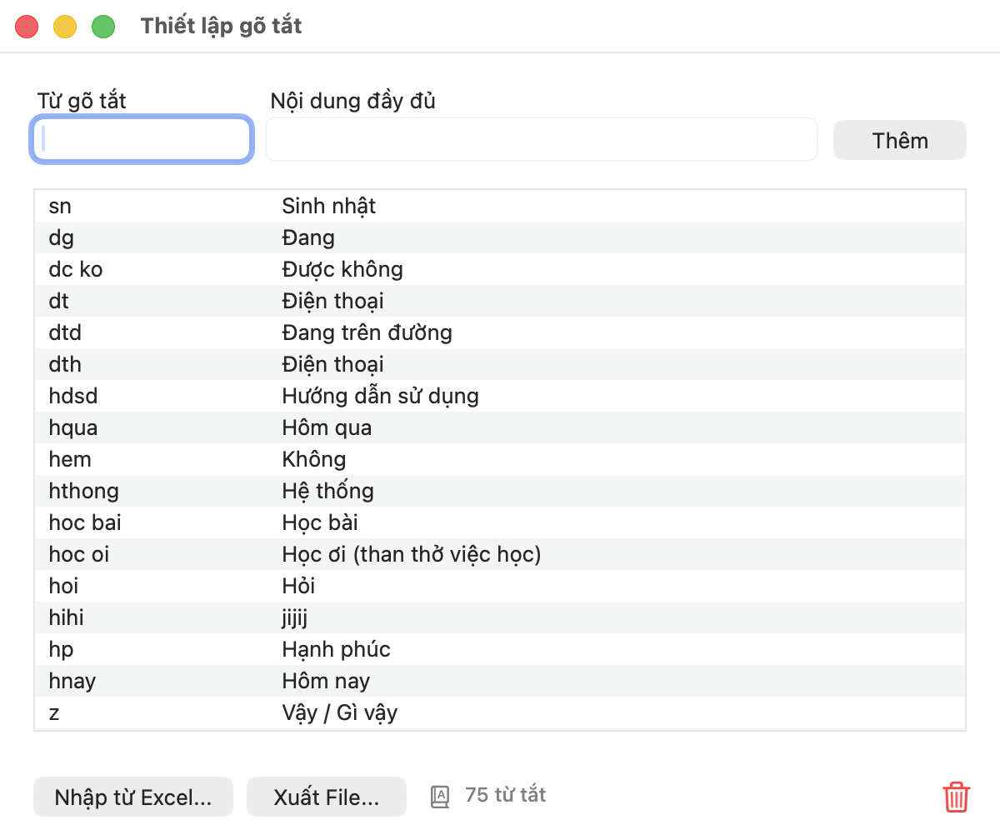
</p>

* **Bố cục co giãn thông minh (Responsive):** Khi phóng to cửa sổ, cột "Nội dung đầy đủ" tự động mở rộng bao phủ toàn bộ bảng, các nút chức năng neo chuẩn góc trên bên phải.
* **Thao tác thêm mới thông minh:** Khi bạn nhấp chọn 1 từ có sẵn trong danh sách, nút **"Thêm mới"** sẽ xuất hiện ngay trên đầu nút **"Xoá"**. Bấm "Thêm mới" sẽ tự động xoá sạch 2 ô nhập liệu để sẵn sàng nhập từ mới.

<p align="center">
  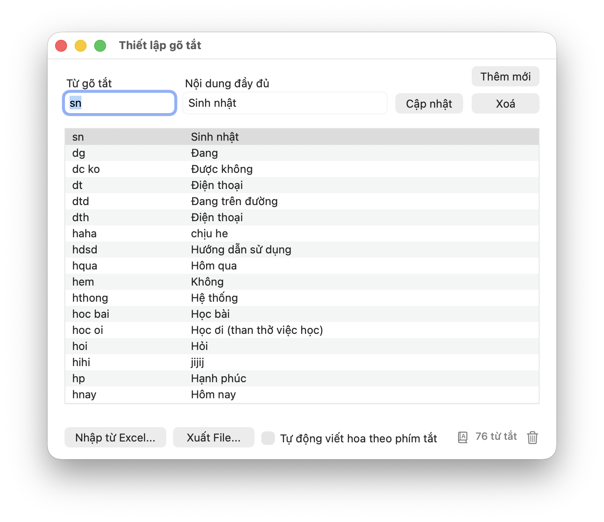
</p>

* **Huy hiệu số lượng & Xoá tất cả an toàn:**
  - Góc phải dưới cùng hiển thị huy hiệu số lượng: `[📖] [76 từ tắt]`.
  - Icon thùng rác kế bên cho phép xoá tất cả dữ liệu gõ tắt hiện có với hộp thoại xác nhận chuyên nghiệp, icon và tiêu đề căn giữa:

<p align="center">
  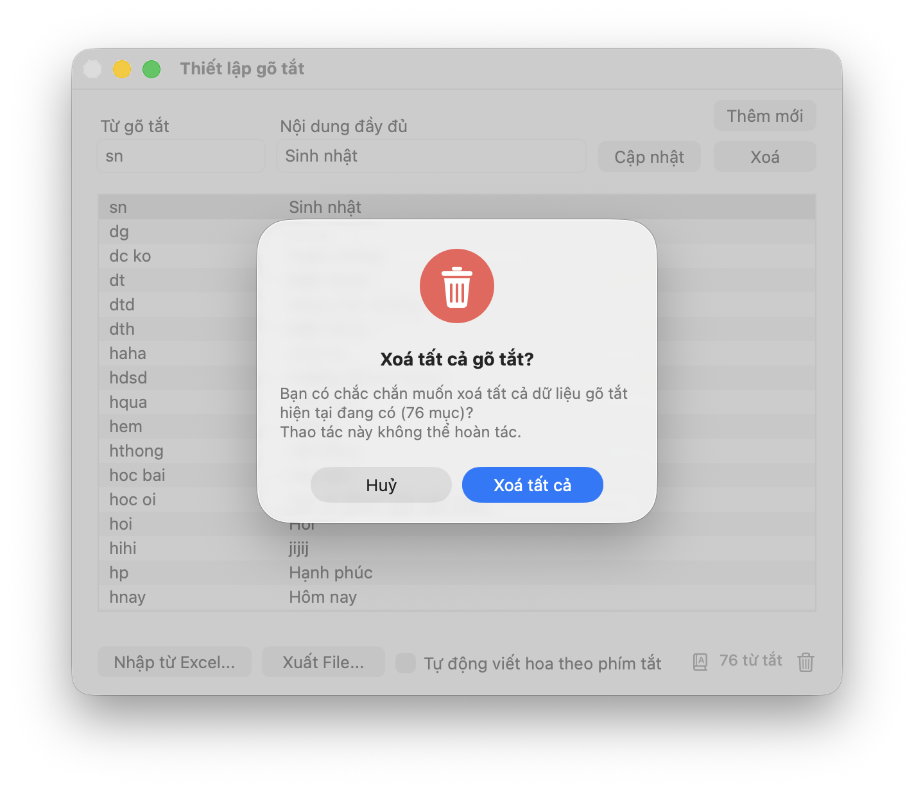
</p>

* **Nhập / Xuất Excel (.xlsx) & CSV chuẩn Unicode (NFC):**
  - Bấm **"Nhập từ Excel..."** để nhập hàng loạt danh sách từ bảng tính.
  - Bấm **"Xuất File..."** để lưu bảng gõ tắt ra tệp Excel `.xlsx` hoặc `.csv` (UTF-8 BOM). Đảm bảo mở trên mọi phiên bản Excel (Windows & Mac) hiển thị tiếng Việt trọn vẹn, không bao giờ lỗi font:

<p align="center">
  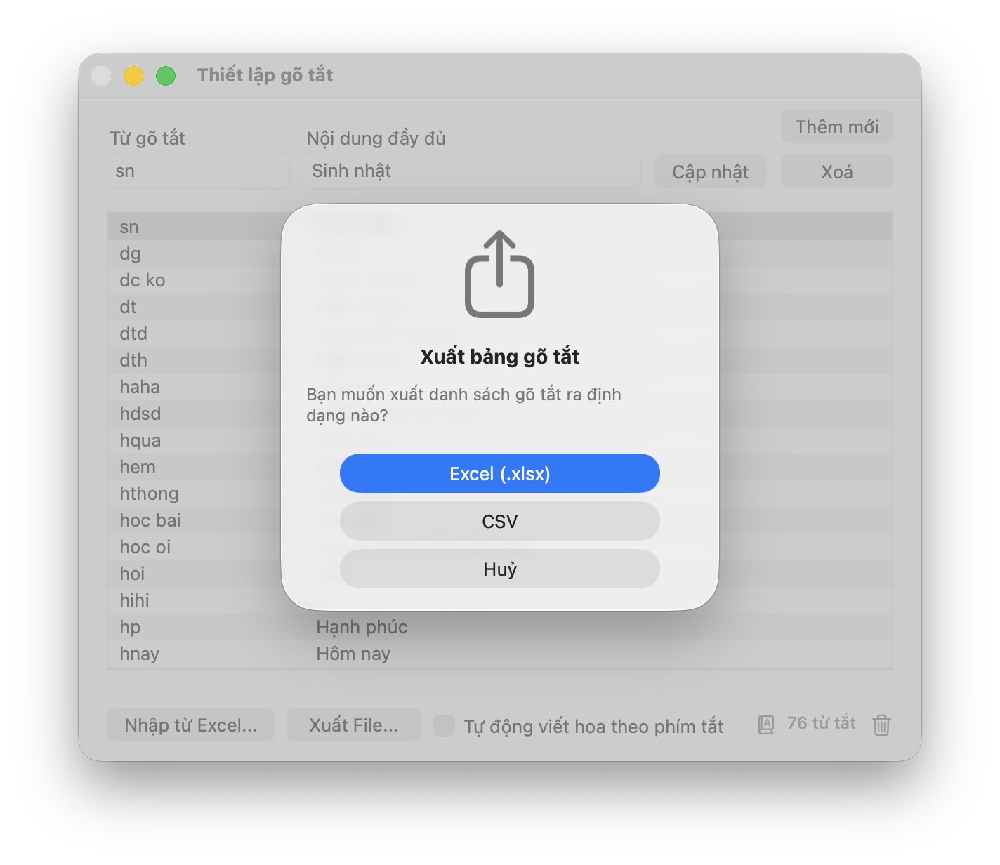
</p>

* **Gợi ý từ gõ tắt nổi & Viết hoa thông minh theo ngữ cảnh (Mới trong v1.0.3):**
  - **Bong bóng gợi ý tức thì:** Khi gõ một từ tắt (ví dụ `cty`, `sn`, `stkbidv`, `hp`...), một bong bóng gợi ý nhỏ gọn, bo góc mềm mại sẽ tự động hiển thị ngay phía trên con trỏ soạn thảo:

<p align="center">
  
</p>

  - **Thao tác thuận tiện:**
    + Nhấn phím **Space (khoảng trắng)**: Tự động chuyển đổi từ tắt thành từ ngữ hoàn chỉnh và ẩn gợi ý tức thì.
    + Nhấn phím **Escape (Esc)** hoặc click nút **`✕`**: Ẩn gợi ý và bỏ qua chuyển đổi cho từ đó (nhấn Space sau đó chỉ thêm khoảng trắng bình thường mà không biến đổi từ).
  - **Quy tắc viết hoa thông minh theo vị trí câu:**
    + **Đầu câu:** Tự động viết hoa chữ cái đầu tiên khi bắt đầu gõ hoặc sau các dấu kết thúc câu (`.`, `!`, `?` kèm Space/Enter).
      * *Ví dụ:* `cty không ổn lắm` ➔ `Công ty không ổn lắm`
      * *Ví dụ:* `tôi khỏe! bt` ➔ `tôi khỏe! Bình thường`
    + **Giữa câu:** Tự động chuyển chữ cái đầu tiên thành chữ thường khi đứng ở giữa câu hoặc sau dấu phẩy (ngay cả khi từ gốc trong từ điển được lưu dạng chữ hoa).
      * *Ví dụ:* Từ tắt `hp` (lưu là `Hạnh phúc`), khi gõ `Hôm nay, tôi hp` ➔ `Hôm nay, tôi hạnh phúc`
    + **Tôn trọng phím Shift:** Khi người dùng chủ động gõ phím viết hoa bằng Shift (ví dụ `Hp` hoặc `HP`), MacKey luôn tôn trọng và giữ nguyên ý định viết hoa của người dùng.

---

### 4. Công cụ chuyển mã văn bản (Convert Tool)

Mở từ Menu bar → **Công cụ chuyển mã...**:

<p align="center">
  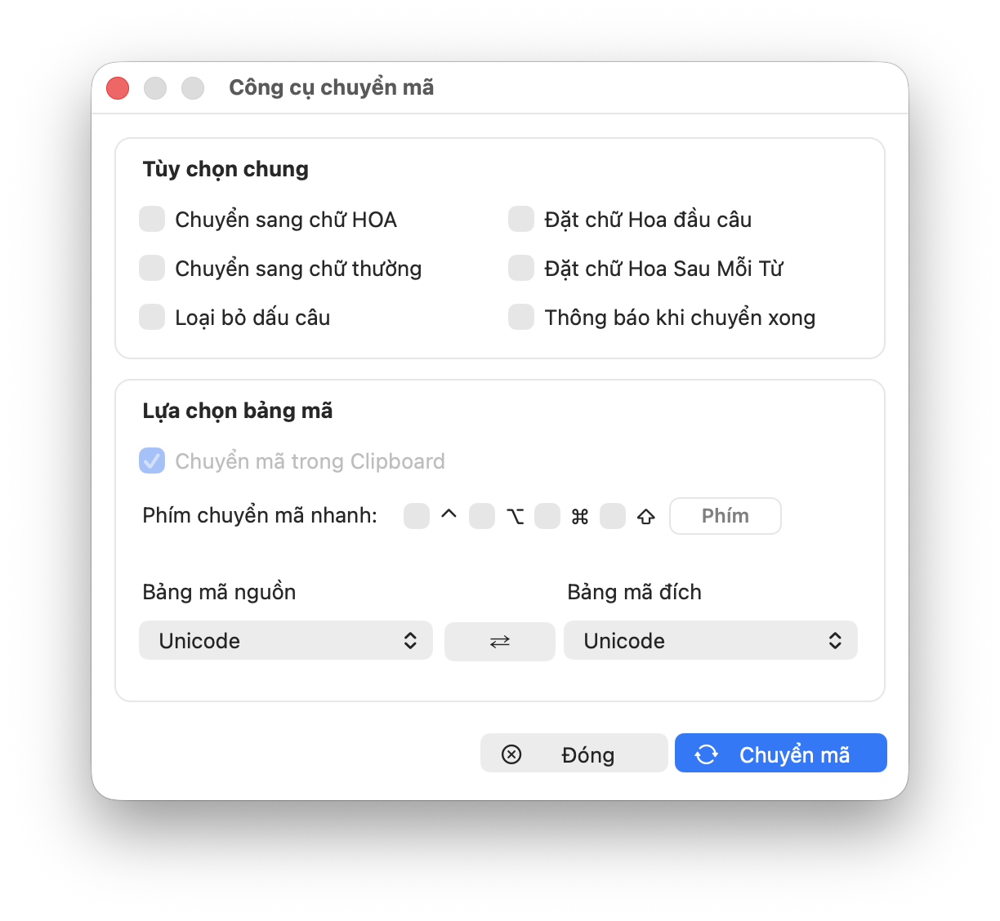
</p>

* **Chuyển mã Clipboard đa năng:** Chuyển đổi văn bản có sẵn trong bộ nhớ tạm (Clipboard) giữa các bảng mã tiếng Việt phổ biến: **Unicode**, **TCVN3 (ABC)**, **VNI Windows**, **VIQR**, **Unicode tổ hợp**... Nút **`⇄`** giúp đảo chiều bảng mã Nguồn và Đích nhanh chóng.
  - *Ví dụ tài liệu cũ sang chuẩn mới:* `tiÕng viÖt` (TCVN3) ➔ `tiếng việt` (Unicode dựng sẵn).
  - *Ví dụ phần mềm đồ hoạ cũ:* `Bảo mật` (Unicode) ➔ `baûo maät` (VNI Windows).

* **Các tuỳ chọn định dạng văn bản nâng cao:**

| Tuỳ chọn | Mô tả công dụng | Ví dụ trước | Ví dụ sau |
| :--- | :--- | :--- | :--- |
| **Chữ HOA** | Chuyển toàn bộ ký tự sang in hoa | `Việt Nam quê hương tôi.` | `VIỆT NAM QUÊ HƯƠNG TÔI.` |
| **Chữ thường** | Chuyển toàn bộ ký tự sang in thường | `BỘ GÕ TIẾNG VIỆT MACKEY` | `bộ gõ tiếng việt mackey` |
| **Viết hoa đầu câu** | Tự động viết hoa chữ cái đầu sau dấu chấm, chấm hỏi, chấm cảm (`.`, `?`, `!`) | `hôm nay trời đẹp. bạn khoẻ không? vâng, tôi khoẻ!` | `Hôm nay trời đẹp. Bạn khoẻ không? Vâng, tôi khoẻ!` |
| **Viết Hoa Chữ Cái Đầu Mỗi Từ** | Viết hoa chữ cái đầu của từng từ (rất tiện căn chỉnh họ tên, tiêu đề) | `nguyễn đình phú - bộ gõ mackey` | `Nguyễn Đình Phú - Bộ Gõ Mackey` |
| **Loại bỏ dấu tiếng Việt** | Bỏ dấu thanh, dấu mũ, dấu móc (rất tiện để đổi tên file, đặt URL slug, tên biến code) | `Việt Nam quê hương tôi!` | `viet nam que huong toi!` |

* **Hỗ trợ kết hợp linh hoạt:** Bạn có thể tích chọn đồng thời nhiều tuỳ chọn, ví dụ:
  - *Loại bỏ dấu* + *Chữ HOA*: `Phạm Văn Đồng` ➔ `PHAM VAN DONG`
  - *Loại bỏ dấu* + *Viết hoa mỗi từ*: `nguyễn đình phú` ➔ `Nguyen Dinh Phu`

* **Phím tắt chuyển mã nhanh Clipboard (Quick Convert Hotkey):**
  - Không cần mất công mở giao diện ứng dụng.
  - Chỉ cần **bôi đen văn bản** ➔ bấm `⌘ + C` (Copy) ➔ bấm **Tổ hợp phím tắt chuyển mã nhanh** đã thiết lập ➔ bấm `⌘ + V` (Paste) để dán ngay kết quả đã chuyển đổi.
  - Tuỳ chọn **"Hiển thị thông báo khi chuyển mã xong"**: hiện hộp thoại thông báo trực quan hoặc chuyển ngầm êm ái.

---

### 5. Kiểm tra cập nhật tự động từ GitHub

Mở từ Menu bar → **Giới thiệu**:

<p align="center">
  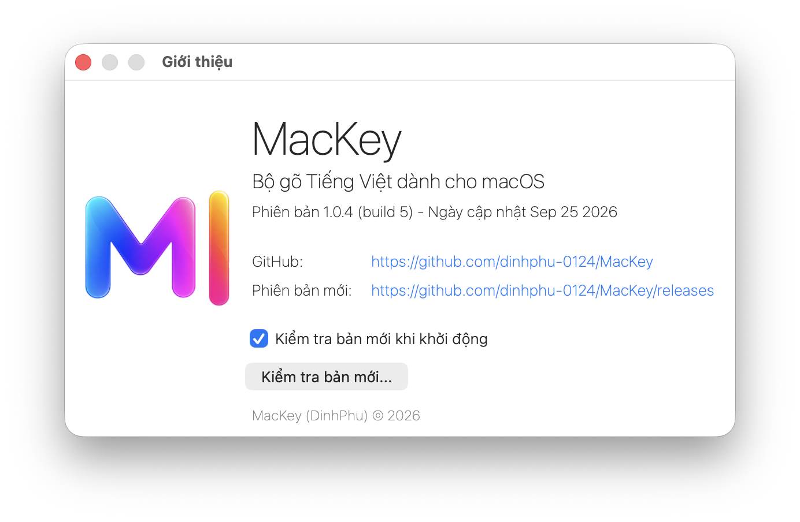
</p>

* Giao diện tinh gọn với 2 dòng liên kết chính: **GitHub** và **Phiên bản mới**.
* Nút **"Kiểm tra bản mới..."** tự động đối chiếu với phiên bản mới nhất trên GitHub Releases:
  - **Nếu đã là bản mới nhất:** Hiện hộp thoại xác nhận giao diện đẹp mắt:
    <p align="center">
      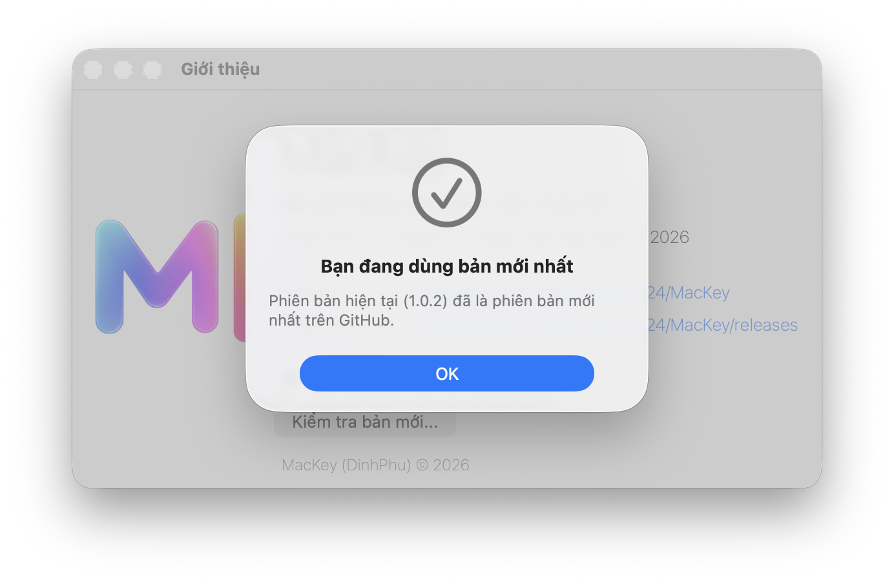
    </p>
  - **Nếu có bản cập nhật mới trên GitHub:** Xuất hiện hộp thoại hỏi bạn có muốn cập nhật hay không, cung cấp nút **"Cập nhật ngay"** (tải trực tiếp file cài đặt `.dmg` từ Git), **"Xem trên GitHub"** hoặc **"Để sau"**.

---

## 📥 Hướng dẫn cài đặt & Cấp quyền chi tiết

### Yêu cầu hệ thống
* Máy Mac chạy **macOS 10.15 (Catalina)** trở lên (hỗ trợ đầy đủ macOS 11 Big Sur, macOS 12 Monterey, macOS 13 Ventura, macOS 14 Sonoma, **macOS 15+ Sequoia**).
* Chạy Native trên mọi dòng chip **Apple Silicon (M1, M2, M3, M4)** và **Intel**.

---

### Bước 1: Tải về và cài đặt từ file DMG

1. Truy cập [Trang Releases của MacKey](https://github.com/dinhphu-0124/MacKey/releases/latest) và tải file **`MacKey-1.0.3.dmg`**.
2. Nhấp đúp chuột (double-click) vào file `.dmg` vừa tải về để mở cửa sổ cài đặt.
3. **Kéo biểu tượng MacKey** ở bên trái và **thả vào thư mục Applications** ở bên phải:

<p align="center">
  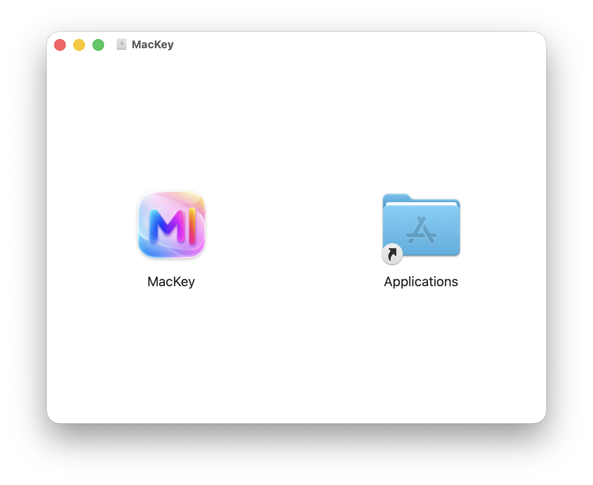
</p>

4. Chờ 2-3 giây để macOS sao chép xong. Sau đó bạn có thể đóng cửa sổ DMG và xóa file tải về.

---

### Bước 2: Mở ứng dụng lần đầu (Vượt Gatekeeper)

Vì MacKey là phần mềm mã nguồn mở miễn phí và chưa đăng ký chứng chỉ nhà phát triển có phí của Apple, macOS sẽ hiển thị hộp thoại bảo vệ Gatekeeper ở lần mở đầu tiên.

1. Mở **Finder** → chọn mục **Ứng dụng (Applications)** ở cột bên trái.
2. Tìm đến biểu tượng **MacKey**:

<p align="center">
  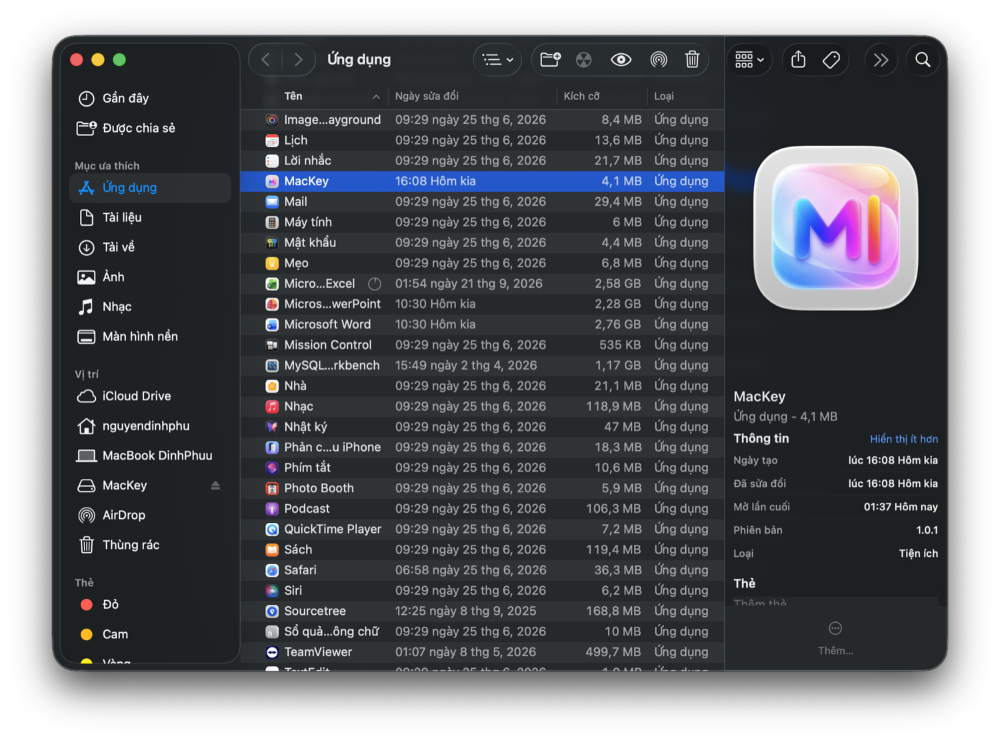
</p>

3. **Thao tác mở an toàn:**
   - **Click chuột phải** (hoặc giữ phím `Control` rồi click) vào **MacKey** → chọn **Mở (Open)**.
   - Hộp thoại cảnh báo bảo mật hiện ra → Nhấn nút **Mở (Open)** một lần nữa.
   > [!TIP]
   > Bạn chỉ cần thực hiện thao tác click chuột phải này **duy nhất 1 lần đầu tiên**. Từ các lần sau, bạn có thể click đúp mở app bình thường như mọi phần mềm khác.

> [!NOTE]
> *Nếu trước đó bạn lỡ click đúp và bị macOS chặn hoàn toàn:*  
> Hãy mở **Cài đặt hệ thống (System Settings)** → **Quyền riêng tư & Bảo mật (Privacy & Security)** → cuộn xuống mục **Bảo mật** và nhấn nút **Vẫn mở (Open Anyway)** bên cạnh dòng thông báo MacKey.

---

### Bước 3: Cấp quyền Trợ năng (Accessibility) - Bắt buộc

> [!IMPORTANT]
> macOS yêu cầu quyền **Trợ năng (Accessibility)** đối với mọi bộ gõ (Unikey, EVKey, OpenKey, MacKey...) để ứng dụng có thể phát hiện phím bạn gõ và điền ký tự tiếng Việt có dấu vào các phần mềm khác (Word, Safari, Chrome, Telegram...).

1. Khi bạn mở MacKey, hộp thoại yêu cầu cấp quyền sẽ hiện lên. Nhấn nút **Cấp quyền** (hoặc tự mở Cài đặt).
2. Mở **Cài đặt hệ thống (System Settings)** trên máy Mac của bạn.
3. Ở cột bên trái, chọn **Quyền riêng tư & Bảo mật (Privacy & Security)**.
4. Ở danh sách bên phải, tìm và chọn mục **Trợ năng (Accessibility)**.
5. Tìm tên **MacKey** trong danh sách và **gạt công tắc sang BẬT (Màu xanh)**:

<p align="center">
  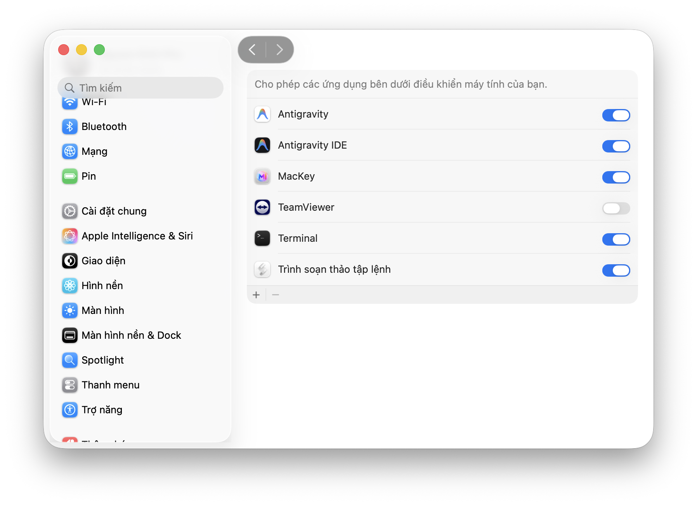
</p>

6. Hệ thống có thể yêu cầu bạn nhập mật khẩu mở máy hoặc chạm vân tay **Touch ID** để xác nhận.
7. Đóng cửa sổ Cài đặt. Bây giờ MacKey đã có đầy đủ quyền để hoạt động mượt mà!

---

### Bước 4: Bắt đầu gõ tiếng Việt & Tùy chọn phím tắt chuyển chế độ

1. **Nhìn lên góc phải thanh menu:** Biểu tượng MacKey xuất hiện với chữ **V** (Tiếng Việt) hoặc **E** (Tiếng Anh).
2. **Chuyển đổi nhanh chế độ gõ:**
   - **Click chuột trực tiếp:** Nhấp chuột vào biểu tượng `[E]` trên thanh menu để đổi sang `[V]` (hoặc ngược lại).
   - **Phím tắt mặc định:** Bấm tổ hợp **`⌥ Option + Z`**.
3. **Tùy chỉnh tổ hợp phím tắt theo ý thích (Không cố định phím "Z"):**
   - Bạn hoàn toàn có thể tự chọn **bất kỳ tổ hợp phím nào quen thuộc** (giống Unikey, EVKey trên Windows hoặc các bộ gõ khác):
     - Click biểu tượng MacKey trên Menu bar ➔ chọn **Bảng điều khiển** (hoặc mở cửa sổ chính).
     - Vào tab **Bộ gõ** ➔ tìm khu vực **Phím chuyển chế độ**.
     - **Tùy chọn phím bổ trợ:** Tích chọn bất kỳ tổ hợp nào bạn muốn trong `⌃` (Control), `⌥` (Option), `⌘` (Command), `⇧` (Shift).
     - **Tùy chọn phím ký tự:**
       - Click vào ô ký tự và gõ bất kỳ phím nào bạn muốn (ví dụ: `Z`, `S`, `W`, `1`...).
       - Hoặc gõ phím **Space** để dùng phím Cách (ví dụ: `⌃ Control + Space`, `⌥ Option + Space`).
       - Hoặc nhấn phím **Delete / Backspace** để xóa trống ô ký tự nếu bạn muốn dùng **chỉ 2 phím bổ trợ** như `⌃ Control + ⇧ Shift` (chuẩn phím quen thuộc trên Windows).
     - **Âm thanh:** Tích chọn *"Âm thanh"* nếu muốn máy phát tiếng beep nhẹ mỗi khi chuyển chế độ thành công.
     - *Mọi thay đổi có hiệu lực ngay lập tức mà không cần khởi động lại ứng dụng!*
4. **Gõ thử tiếng Việt:** Mở một trình soạn thảo bất kỳ (Ghi chú, TextEdit, trình duyệt...) và gõ thử:
   ```
   Vieejt Nam quee huwowng toio -> Việt Nam quê hương tôi
   ```

---

## ⌨️ Các kiểu gõ & Bảng mã hỗ trợ

### Kiểu gõ tiếng Việt
| Kiểu gõ | Quy tắc gõ dấu cơ bản |
| :--- | :--- |
| **Telex** | `s`: sắc, `f`: huyền, `r`: hỏi, `x`: ngã, `j`: nặng, `aa` → â, `aw` → ă, `ee` → ê, `oo` → ô, `ow` → ơ, `uw` → ư, `dd` → đ |
| **VNI** | `1`: sắc, `2`: huyền, `3`: hỏi, `4`: ngã, `5`: nặng, `6`: â/ê/ô, `7`: ơ/ư, `8`: ă, `9`: đ |
| **Simple Telex** | Đơn giản hóa các phím tổ hợp phụ âm kép |

### Bảng mã tiếng Việt
* **Unicode dựng sẵn:** Bảng mã chuẩn quốc tế phổ biến nhất hiện nay.
* **TCVN3 (ABC):** Dùng cho các font cổ điển dạng `.VnTime`, `.VnArial`...
* **VNI Windows:** Dùng cho font `VNI-Times`, `VNI-Helve`...
* **Unicode tổ hợp (Compound):** Dùng cho một số hệ thống cũ hoặc phần mềm chuyên dụng.
* **Vietnamese Locale CP 1258:** Bảng mã của Microsoft Windows.

---

## 🔍 Xử lý sự cố thường gặp

| Tình huống | Nguyên nhân | Cách xử lý |
| :--- | :--- | :--- |
| **Gõ chữ không ra dấu tiếng Việt** | Ứng dụng đang ở chế độ Tiếng Anh (icon chữ E). | Click vào icon trên Menu bar để chuyển sang chữ **V** (màu đỏ), hoặc bấm phím tắt chuyển chế độ (`⌥ Option + Z` hoặc tổ hợp bạn đã tùy chỉnh). |
| **Đã bật chữ V nhưng vẫn không gõ được dấu** | Chưa cấp hoặc bị mất quyền Trợ năng (Accessibility). | Vào **Cài đặt hệ thống → Quyền riêng tư & Bảo mật → Trợ năng**, tắt công tắc MacKey rồi bật lại. Khởi động lại MacKey. |
| **Bị nhảy chữ, lặp chữ hoặc mất dấu** | Xung đột với bộ gõ tiếng Việt mặc định của macOS. | Mở **Cài đặt hệ thống → Bàn phím → Nguồn đầu vào (Input Sources)**, xoá bỏ các bộ gõ tiếng Việt mặc định (chỉ giữ lại nguồn *U.S.* hoặc *Tiếng Anh*). |
| **Bộ gõ không tự bật khi khởi động lại máy** | Tuỳ chọn khởi động cùng hệ thống chưa được kích hoạt. | Mở Bảng điều khiển MacKey → Tab **Hệ thống** → Gạt bật **Khởi động cùng macOS**. |
| **Mở app bị thông báo tệp bị hỏng hoặc không rõ nguồn gốc** | Cơ chế Gatekeeper chặn file tải từ Internet. | Click chuột phải vào MacKey trong thư mục `Applications` → chọn **Open**, xem chi tiết tại [Bước 2](#bước-2-mở-ứng-dụng-lần-đầu-vượt-gatekeeper). |

---

## 🗑️ Hướng dẫn gỡ cài đặt sạch sẽ

Nếu bạn muốn gỡ cài đặt MacKey hoàn toàn khỏi hệ thống:
1. Click vào biểu tượng MacKey trên Menu bar → chọn **Thoát (Quit)**.
2. Mở thư mục **Applications**, kéo **MacKey.app** bỏ vào **Trash (Thùng rác)**.
3. *(Tuỳ chọn dọn sạch file cấu hình)*:
   - Mở Finder, nhấn tổ hợp phím `⌘ Command + ⇧ Shift + G` và dán:
     ```bash
     ~/Library/Preferences/com.dinhphu.mackey.plist
     ```
   - Xoá tệp tin này nếu có.

---

## 📜 Giấy phép & Tác giả

* **Giấy phép:** [GNU General Public License v3.0 (GPLv3)](https://www.gnu.org/licenses/gpl-3.0).
* **Nền tảng mã nguồn gốc:** Kế thừa từ dự án [OpenKey](https://github.com/tuyenvm/OpenKey) của tác giả **Tuyền Mai** và cộng đồng OpenKey.
* **Bản phát triển & Tối ưu hóa:** **DinhPhu** © 2026.
* **Đóng góp & Phản hồi:** Mọi thắc mắc hoặc yêu cầu tính năng, xin vui lòng tạo [Issue trên GitHub](https://github.com/dinhphu-0124/MacKey/issues) hoặc liên hệ qua email: `dinhphuhcmus15@gmail.com`.
