# MacKey (v1.0.4) — Bộ gõ Tiếng Việt Hiện Đại cho macOS

<p align="center">
  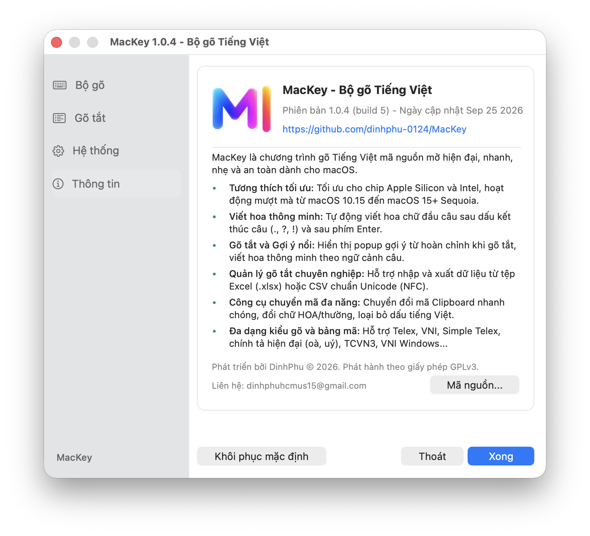
</p>

<p align="center">
  <a href="https://github.com/dinhphu-0124/MacKey/releases/latest"></a>
  <a href="https://github.com/dinhphu-0124/MacKey/releases"></a>
  <a href="#"></a>
  <a href="https://www.gnu.org/licenses/gpl-3.0"></a>
</p>

<p align="center">
  <a href="https://github.com/dinhphu-0124/MacKey/releases/latest/download/MacKey-1.0.4.dmg">
    
  </a>
  <br/>
  <sub>Tương thích hoàn hảo với chip <b>Apple Silicon (M1/M2/M3/M4)</b> và <b>Intel</b> từ macOS 10.15 Catalina đến <b>macOS 15+ Sequoia</b></sub>
</p>

---

## 📖 Mục lục

1. [🌟 Tính năng nổi bật](#-tính-năng-nổi-bật)
2. [📸 Tổng quan giao diện & Chức năng](#-tổng-quan-giao-diện--chức-năng)
   - [Menu thanh trạng thái (Menu Bar)](#1-menu-thanh-trạng-thái-menu-bar)
   - [Bảng điều khiển chính (Dashboard)](#2-bảng-điều-khiển-chính-dashboard)
   - [Quản lý gõ tắt (Macro)](#3-quản-lý-gõ-tắt-macro)
   - [Công cụ chuyển mã văn bản (Convert Tool)](#4-công-cụ-chuyển-mã-văn-bản-convert-tool)
   - [Kiểm tra cập nhật tự động từ GitHub](#5-kiểm-tra-cập-nhật-tự-động-từ-github)
3. [📥 Hướng dẫn cài đặt & Cấp quyền chi tiết (Có hình ảnh)](#-hướng-dẫn-cài-đặt--cấp-quyền-chi-tiết)
   - [Bước 1: Tải về và cài đặt từ file DMG](#bước-1-tải-về-và-cài-đặt-từ-file-dmg)
   - [Bước 2: Mở ứng dụng lần đầu (Vượt Gatekeeper)](#bước-2-mở-ứng-dụng-lần-đầu-vượt-gatekeeper)
   - [Bước 3: Cấp quyền Trợ năng (Accessibility)](#bước-3-cấp-quyền-trợ-năng-accessibility---bắt-buộc)
   - [Bước 4: Bắt đầu gõ tiếng Việt](#bước-4-bắt-đầu-gõ-tiếng-việt--tùy-chọn-phím-tắt-chuyển-chế-độ)
4. [⌨️ Các kiểu gõ & Bảng mã hỗ trợ](#️-các-kiểu-gõ--bảng-mã-hỗ-trợ)
5. [🔍 Xử lý sự cố thường gặp (FAQ)](#-xử-lý-sự-cố-thường-gặp)
6. [🗑️ Hướng dẫn gỡ cài đặt sạch sẽ](#️-hướng-dẫn-gỡ-cài-đặt-sạch-sẽ)
7. [📜 Giấy phép & Tác giả](#-giấy-phép--tác-giả)

---

## 🌟 Tính năng nổi bật

* 🧠 **Viết hoa thông minh:** Tự động viết hoa chữ cái đầu tiên sau các dấu kết thúc câu (`.`, `?`, `!`), không tự ý viết hoa khi mở app hay chuyển ô nhập, giữ phím thường tự nhiên khi gõ.
* ⚡ **Giao diện hiện đại chuẩn macOS:** Hỗ trợ đầy đủ Dark Mode và Light Mode, tối ưu theo phong cách chuẩn macOS.
* 📝 **Quản lý gõ tắt tiện lợi:** Hỗ trợ nhập và xuất danh sách phím tắt qua tệp Excel (`.xlsx`) hoặc `.csv` chuẩn Unicode NFC, hiển thị gợi ý khi gõ từ tắt.
* 🔄 **Cập nhật trực tiếp từ GitHub Releases:** Tự động đối chiếu phiên bản qua GitHub Releases API, tải nhanh bản cập nhật mới về máy.
* 🚀 **Universal 2 siêu nhẹ:** Chạy trực tiếp (Native) trên cả Apple Silicon (`arm64`) và Intel (`x86_64`), tiêu thụ rất ít RAM và tài nguyên.
* 🛡️ **Minh bạch & An toàn:** Mã nguồn mở GPLv3, không thu thập thao tác phím (keylogger), đảm bảo quyền riêng tư.

> [!WARNING]
> **Tránh xung đột bộ gõ:** Khi sử dụng MacKey, hãy tắt hoặc xoá các bộ gõ tiếng Việt mặc định khác của macOS (như *Vietnamese Simple Telex* trong Cài đặt bàn phím) hoặc tắt EVKey để tránh tình trạng hai bộ gõ cùng xử lý phím gây nhảy chữ.

---

## 📸 Tổng quan giao diện & Chức năng

### 1. Menu thanh trạng thái (Menu Bar)

Biểu tượng trên thanh trạng thái cho biết chế độ gõ hiện tại:
* **Chữ V (đỏ):** Chế độ gõ Tiếng Việt.
* **Chữ E (xám):** Chế độ gõ Tiếng Anh.

<p align="center">
  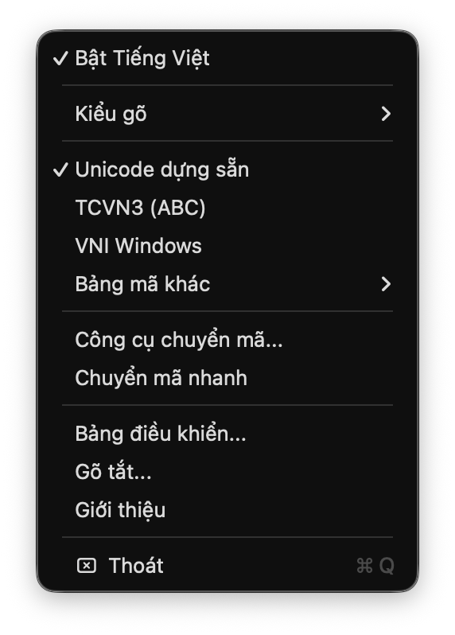
</p>

**Các chức năng trên Menu:**
* **Bật/Tắt Tiếng Việt:** Chuyển đổi qua lại giữa chế độ gõ Tiếng Việt và Tiếng Anh.
* **Kiểu gõ:** Chọn kiểu gõ ưa thích (**Telex**, **VNI**, **Simple Telex**).
* **Bảng mã:** Chọn bảng mã xuất chữ (**Unicode dựng sẵn**, **TCVN3 (ABC)**, **VNI Windows**...).
* **Công cụ chuyển mã...:** Mở cửa sổ chuyển đổi mã và định dạng văn bản.
* **Bảng điều khiển...:** Mở cửa sổ cài đặt chính của ứng dụng.
* **Gõ tắt...:** Mở cửa sổ danh sách và quản lý từ gõ tắt.
* **Giới thiệu:** Xem thông tin ứng dụng và kiểm tra bản cập nhật mới.
* **Thoát:** Đóng hoàn toàn ứng dụng MacKey.

---

### 2. Bảng điều khiển chính (Dashboard)

Giao diện Bảng điều khiển gồm 4 tab thiết lập:

#### Tab "Bộ gõ" — Thiết lập gõ Tiếng Việt
<p align="center">
  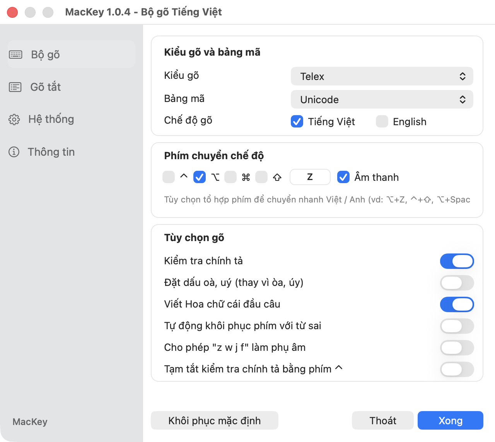
</p>

* **Kiểu gõ & Bảng mã:** Lựa chọn kiểu gõ (Telex, VNI...) và bảng mã văn bản đầu ra.
* **Phím chuyển chế độ (Switch Key):** Thiết lập tổ hợp phím tắt để đổi nhanh Tiếng Việt / Tiếng Anh (ví dụ: `⌥ Option + Z`, `⌃ Control + Space`...) và tùy chọn âm thanh thông báo.
* **Kiểm tra chính tả:** Bật/tắt kiểm tra lỗi chính tả trong khi gõ (có thể tạm dừng kiểm tra bằng cách giữ phím `⌃ Control`).
* **Đặt dấu oà, uý:** Bật/tắt cách bỏ dấu theo chuẩn chính tả mới (`oà, uý` thay vì `òa, úy`).
* **Tự động khôi phục phím gốc:** Tự động trả về ký tự gốc khi phát hiện từ gõ sai ngữ pháp tiếng Việt.
* **Cho phép dùng z, w, j, f:** Cho phép gõ các ký tự này độc lập mà không bị xử lý thành dấu hay phím chức năng.

#### Tab "Gõ tắt" — Cấu hình gõ tắt & Tốc ký
<p align="center">
  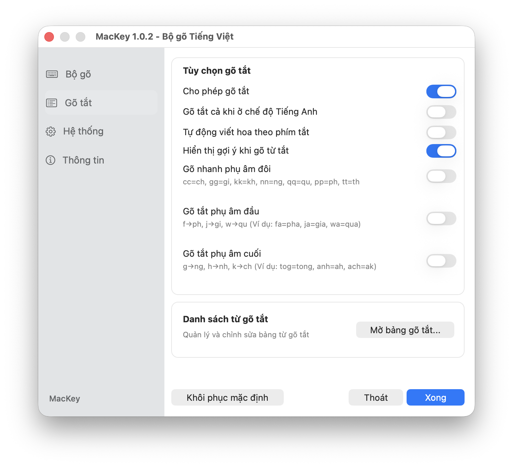
</p>

* **Cho phép gõ tắt:** Bật hoặc tắt tính năng gõ tắt trên toàn hệ thống.
* **Gõ tắt cả khi ở chế độ Tiếng Anh:** Cho phép kích hoạt từ viết tắt ngay cả khi đang bật chế độ gõ Tiếng Anh (icon E).
* **Tự động viết hoa theo phím tắt:** Tự động điều chỉnh chữ hoa/chữ thường của từ mở rộng theo cách gõ phím tắt (ví dụ: `ko` ➔ `không`, `Ko` ➔ `Không`, `KO` ➔ `KHÔNG`).
* **Hiển thị gợi ý khi gõ từ tắt:** Bật khung bong bóng hiển thị trước từ mở rộng khi đang nhập từ tắt.
* **Gõ nhanh phụ âm đôi:** Tự động biến đổi các cặp phụ âm lặp (`cc` → `ch`, `gg` → `gi`, `kk` → `kh`, `nn` → `ng`, `qq` → `qu`, `pp` → `ph`, `tt` → `th`).
* **Gõ tắt phụ âm đầu/cuối:** Viết tắt nhanh các âm tiết thông dụng (`f` → `ph`, `j` → `gi`, `w` → `qu`, `g` → `ng`, `h` → `nh`...).
* **Nút "Mở bảng gõ tắt...":** Mở cửa sổ danh sách từ viết tắt để thêm, sửa, xóa.

#### Tab "Hệ thống" — Tùy chọn hệ thống
<p align="center">
  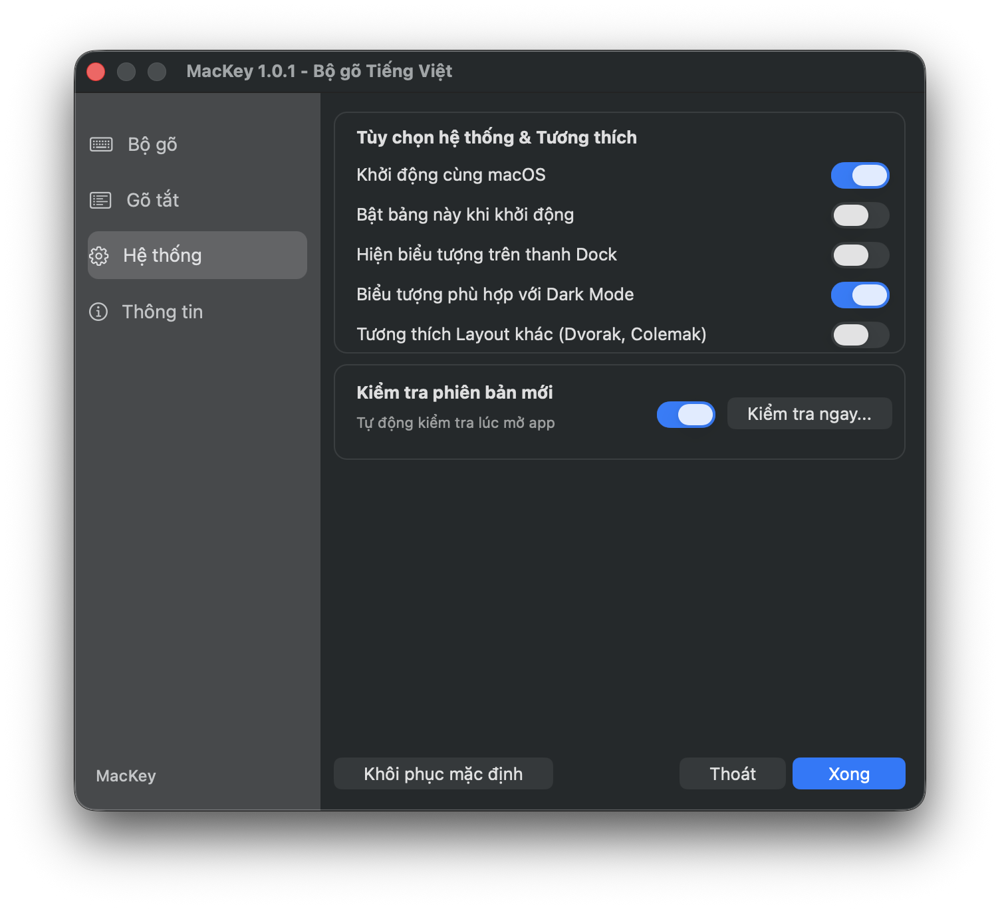
</p>

* **Khởi động cùng macOS:** Tự động mở MacKey khi máy Mac khởi động hoặc đăng nhập.
* **Hiện cửa sổ khi khởi động:** Tự động mở Bảng điều khiển ngay sau khi MacKey khởi chạy.
* **Ẩn icon thanh Dock:** Ẩn biểu tượng MacKey trên Dock, chỉ duy trì hoạt động trên Menu Bar.
* **Tương thích layout khác:** Hỗ trợ tối ưu cho các bàn phím layout thay thế (Dvorak, Colemak...).
* **Kiểm tra phiên bản mới:** Tự động kiểm tra bản cập nhật mới mỗi khi mở ứng dụng.

#### Tab "Thông tin" — Thông tin phiên bản & Liên kết
<p align="center">
  
</p>

* **Thông tin ứng dụng:** Xem số hiệu phiên bản phát hành (version) và mã bản dựng (build).
* **Nút "Mã nguồn GitHub":** Mở trang kho mã nguồn của dự án trên trình duyệt.
* **Nút "Liên hệ / Hỗ trợ":** Gửi thư hỗ trợ hoặc đóng góp ý kiến tới tác giả.

---

### 3. Quản lý gõ tắt (Macro)

Cửa sổ quản lý danh sách từ tắt giúp bạn xem và biên tập các cụm từ viết tắt:

<p align="center">
  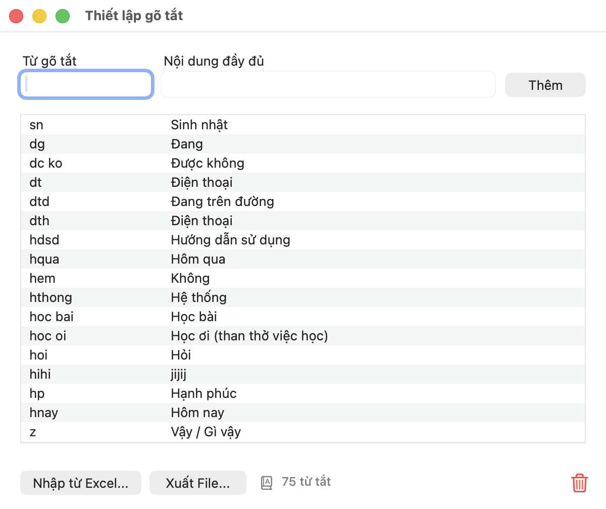
</p>

**Các chức năng chính:**
* **Bảng danh sách từ viết tắt:** Hiển thị toàn bộ các cặp Từ gõ tắt và Cụm từ thay thế tương ứng.
* **Ô nhập "Từ viết tắt" & "Thay thế bằng":** Dùng để nhập hoặc chỉnh sửa nội dung cặp từ tắt.
* **Nút "Lưu":** Lưu cặp từ vừa nhập hoặc chỉnh sửa vào danh sách.
* **Nút "Thêm mới":** Đưa các ô nhập liệu về trạng thái trống để sẵn sàng thêm một cặp từ mới.
<p align="center">
  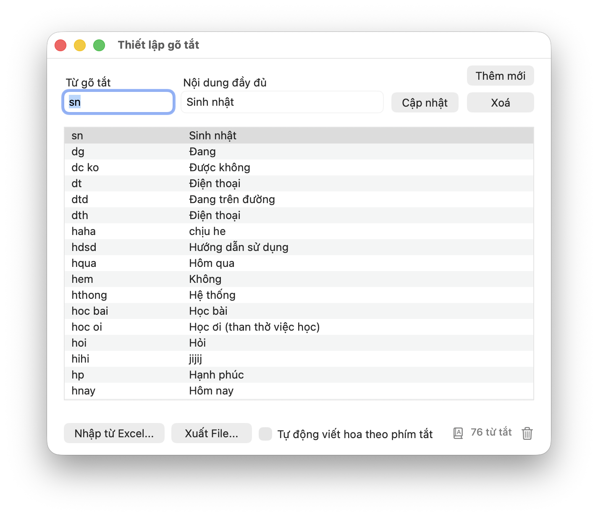
</p>

* **Nút "Xóa":** Xóa cặp từ gõ tắt đang được chọn trong danh sách.
* **Nút Thùng rác (Xóa tất cả):** Xóa toàn bộ danh sách từ viết tắt kèm hộp thoại xác nhận an toàn trước khi thực hiện.
<p align="center">
  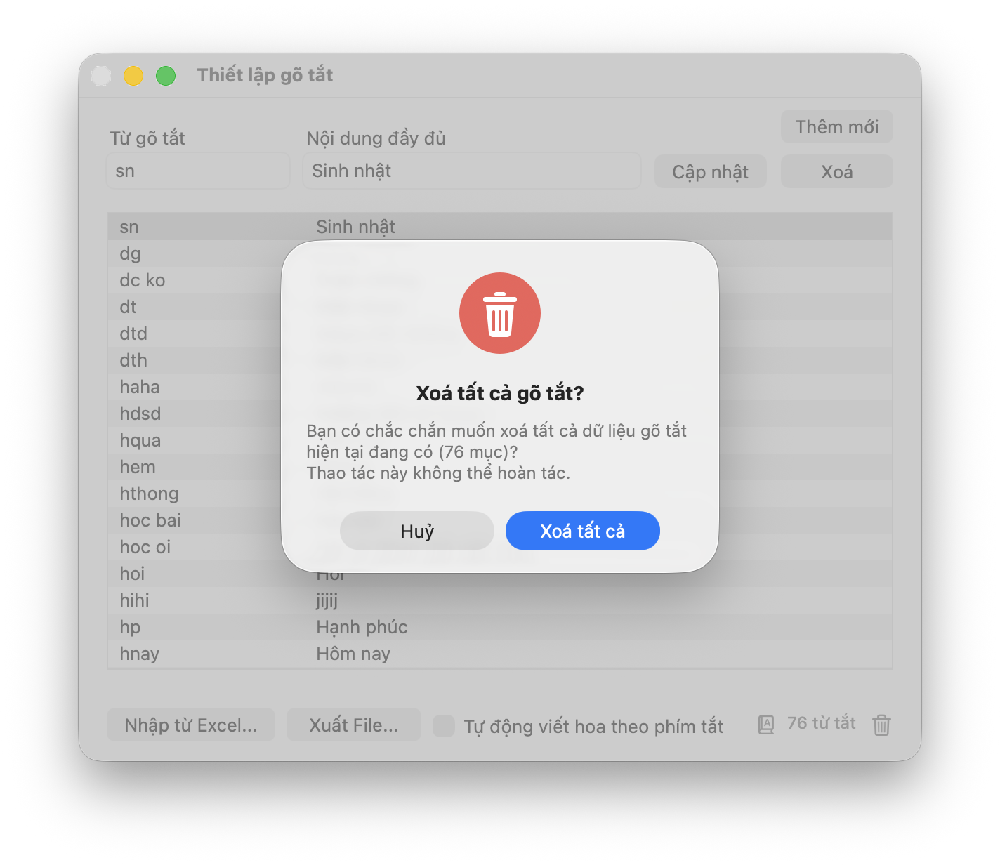
</p>

* **Huy hiệu số lượng từ:** Hiển thị tổng số lượng từ gõ tắt hiện có trong cơ sở dữ liệu.
* **Nút "Nhập từ Excel...":** Nhập hàng loạt danh sách từ tắt từ tệp bảng tính Excel (`.xlsx`) hoặc `.csv`.
* **Nút "Xuất File...":** Xuất toàn bộ danh sách từ tắt ra file `.xlsx` hoặc `.csv` (chuẩn UTF-8 NFC) để sao lưu hoặc dùng cho máy khác.
<p align="center">
  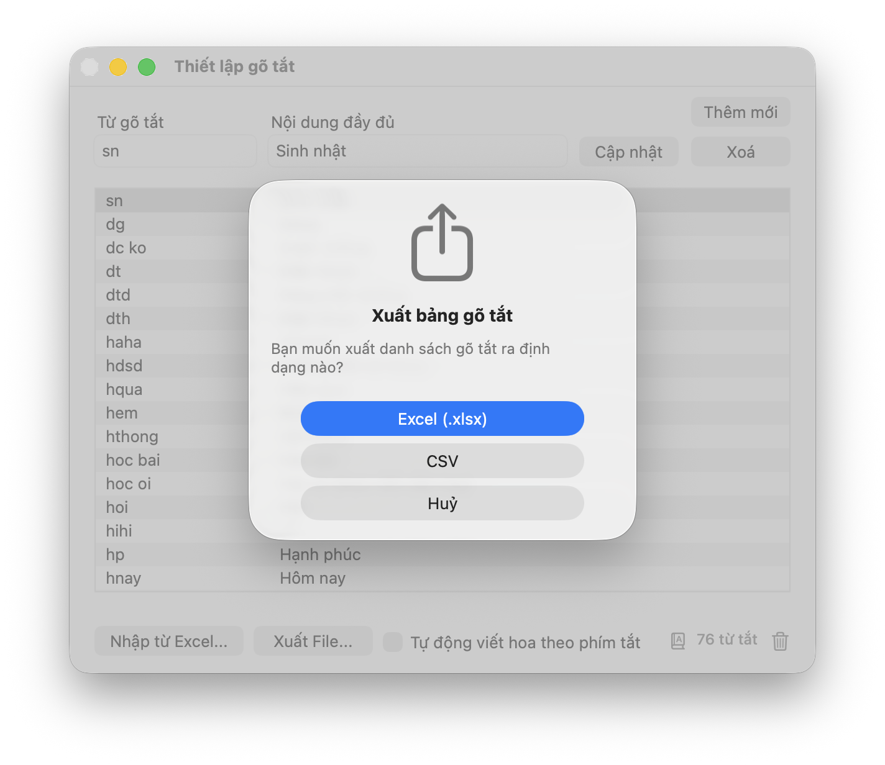
</p>

* **Gợi ý gõ tắt & Cơ chế kích hoạt:**
  - Khi gõ một từ tắt, bong bóng gợi ý sẽ xuất hiện ngay tại con trỏ văn bản.
<p align="center">
  
</p>

  - **Phím Space (Cách):** Chấp nhận gợi ý và thay thế thành cụm từ đầy đủ.
  - **Phím Escape (Esc) hoặc nút ✕:** Hủy gợi ý, giữ nguyên văn bản vừa gõ mà không chuyển đổi.
  - **Quy tắc viết hoa thông minh:** Tự động viết hoa chữ cái đầu khi đứng ở đầu câu (sau dấu `.`, `?`, `!`), tự động chuyển chữ thường khi ở giữa câu, hoặc giữ nguyên kiểu chữ hoa nếu bạn chủ động bấm giữ phím `Shift`.

---

### 4. Công cụ chuyển mã văn bản (Convert Tool)

Mở từ Menu bar → **Công cụ chuyển mã...**:

<p align="center">
  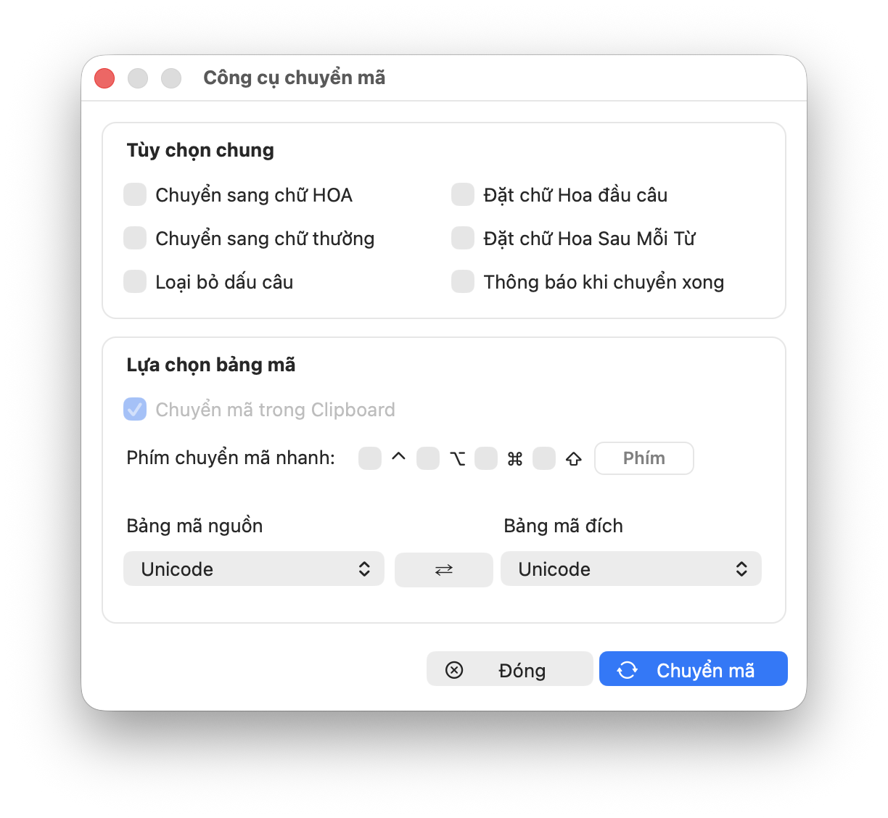
</p>

**Các chức năng chính:**
* **Bảng mã Nguồn và Đích:** Chọn bảng mã ban đầu và bảng mã muốn chuyển đổi thành (Unicode dựng sẵn, TCVN3, VNI Windows, VIQR, Unicode tổ hợp...).
* **Nút `⇄` (Đảo chiều):** Hoán đổi nhanh vị trí giữa bảng mã Nguồn và Đích.
* **Nút "Chuyển mã Clipboard":** Thực hiện chuyển đổi trực tiếp đoạn văn bản đang được lưu trong bộ nhớ tạm (Clipboard).
* **Các tùy chọn biến đổi định dạng chữ:**
  * **Chữ HOA:** Chuyển toàn bộ văn bản sang chữ in hoa (ví dụ: `Việt Nam` ➔ `VIỆT NAM`).
  * **Chữ thường:** Chuyển toàn bộ văn bản sang chữ in thường (ví dụ: `MACKEY` ➔ `mackey`).
  * **Viết hoa đầu câu:** Tự động viết hoa chữ cái đầu tiên sau các dấu chấm kết thúc câu (`.`, `?`, `!`).
  * **Viết Hoa Chữ Cái Đầu Mỗi Từ:** Viết hoa chữ đầu của từng từ (rất tiện căn chỉnh họ tên, tiêu đề).
  * **Loại bỏ dấu tiếng Việt:** Bỏ tất cả dấu thanh, dấu mũ để tạo văn bản không dấu (ví dụ: `Việt Nam` ➔ `viet nam`).
  *(Có thể kết hợp nhiều tùy chọn cùng lúc, ví dụ: Loại bỏ dấu + Chữ HOA).*
* **Phím tắt chuyển mã nhanh (Quick Convert Hotkey):** Cài đặt tổ hợp phím tắt để chuyển mã Clipboard tức thì mà không cần mở giao diện (Copy văn bản `⌘ + C` ➔ Bấm phím tắt chuyển mã ➔ Paste `⌘ + V`).
* **Hiển thị thông báo khi chuyển mã xong:** Bật/tắt thông báo sau khi hoàn tất thao tác chuyển mã.

---

### 5. Kiểm tra cập nhật tự động từ GitHub

Mở từ Menu bar → **Giới thiệu**:

<p align="center">
  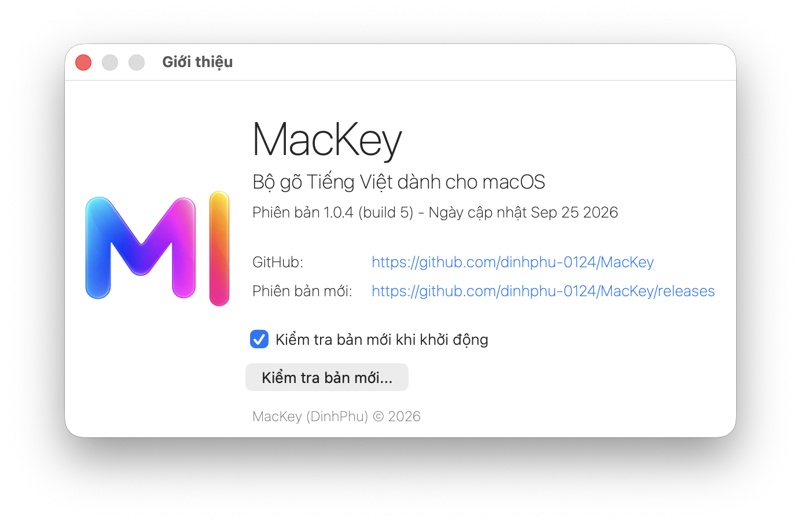
</p>

**Các chức năng chính:**
* **Kiểm tra bản mới...:** Nhấn nút để kết nối GitHub Releases API và kiểm tra xem có bản cập nhật mới hơn hay không.
* **Thông báo phiên bản mới nhất:** Nếu phiên bản hiện tại là mới nhất, hộp thoại sẽ thông báo bạn đang dùng bản cập nhật nhất.
<p align="center">
  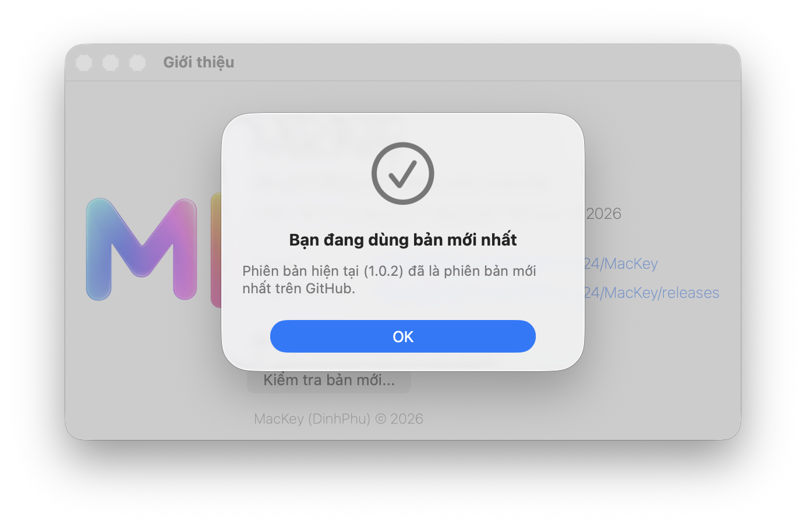
</p>

* **Cập nhật khi có bản mới:** Nếu có phiên bản mới, hộp thoại sẽ cung cấp các nút:
  * **Cập nhật ngay:** Tải trực tiếp file cài đặt `.dmg` của bản mới về máy.
  * **Xem trên GitHub:** Mở trang phát hành trên trình duyệt để xem chi tiết các thay đổi.
  * **Để sau:** Đóng thông báo và giữ nguyên phiên bản hiện tại.

---

## 📥 Hướng dẫn cài đặt & Cấp quyền chi tiết

### Yêu cầu hệ thống
* Máy Mac chạy **macOS 10.15 (Catalina)** trở lên (hỗ trợ macOS 11 Big Sur, macOS 12 Monterey, macOS 13 Ventura, macOS 14 Sonoma, **macOS 15+ Sequoia**).
* Tương thích cả chip **Apple Silicon (M1, M2, M3, M4)** và **Intel**.

---

### Bước 1: Tải về và cài đặt từ file DMG

1. Truy cập [Trang Releases của MacKey](https://github.com/dinhphu-0124/MacKey/releases/latest) và tải file **`MacKey-1.0.4.dmg`**.
2. Nhấp đúp chuột (double-click) vào file `.dmg` vừa tải về để mở cửa sổ cài đặt.
3. **Kéo biểu tượng MacKey** ở bên trái và **thả vào thư mục Applications** ở bên phải:

<p align="center">
  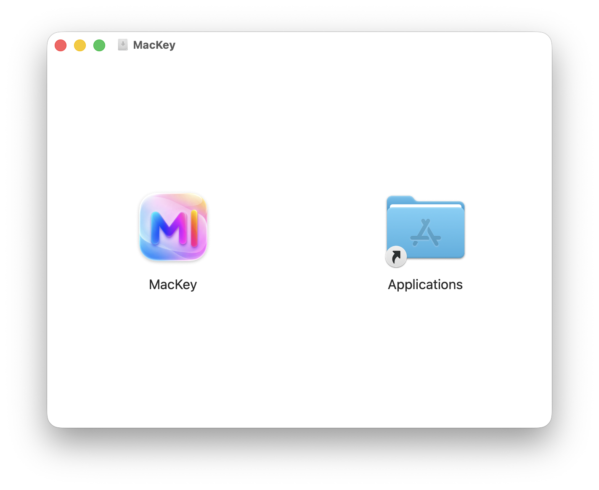
</p>

4. Chờ macOS sao chép xong, sau đó bạn có thể đóng cửa sổ DMG.

---

### Bước 2: Mở ứng dụng lần đầu (Vượt Gatekeeper)

Vì MacKey là phần mềm mã nguồn mở miễn phí và chưa đăng ký chứng chỉ Apple Developer có phí, macOS sẽ hiển thị hộp thoại bảo vệ Gatekeeper ở lần mở đầu tiên.

1. Mở **Finder** → chọn mục **Ứng dụng (Applications)** ở cột bên trái.
2. Tìm đến biểu tượng **MacKey**:

<p align="center">
  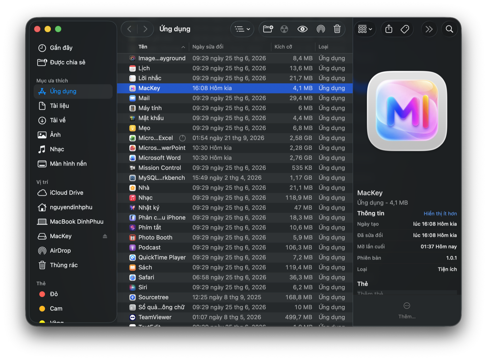
</p>

3. **Thao tác mở:**
   - **Click chuột phải** (hoặc giữ phím `Control` rồi click) vào **MacKey** → chọn **Mở (Open)**.
   - Khi hộp thoại cảnh báo hiện ra → Nhấn nút **Mở (Open)** một lần nữa.
   > [!TIP]
   > Bạn chỉ cần làm thao tác chuột phải này **duy nhất 1 lần đầu tiên**. Những lần sau, bạn có thể click đúp để mở ứng dụng bình thường.

> [!NOTE]
> *Nếu trước đó lỡ click đúp và bị macOS chặn:*  
> Hãy mở **Cài đặt hệ thống (System Settings)** → **Quyền riêng tư & Bảo mật (Privacy & Security)** → cuộn xuống mục **Bảo mật** và nhấn nút **Vẫn mở (Open Anyway)** bên cạnh thông báo MacKey.

---

### Bước 3: Cấp quyền Trợ năng (Accessibility) - Bắt buộc

> [!IMPORTANT]
> macOS yêu cầu quyền **Trợ năng (Accessibility)** đối với mọi bộ gõ tiếng Việt để ứng dụng nhận diện thao tác bàn phím và thay thế ký tự có dấu trên các ứng dụng khác.

1. Khi mở MacKey, nếu thấy hộp thoại yêu cầu cấp quyền hiện lên, nhấn nút **Cấp quyền**.
2. Mở **Cài đặt hệ thống (System Settings)** trên máy Mac.
3. Ở cột bên trái, chọn **Quyền riêng tư & Bảo mật (Privacy & Security)**.
4. Ở danh sách bên phải, tìm và chọn mục **Trợ năng (Accessibility)**.
5. Tìm tên **MacKey** trong danh sách và **gạt công tắc sang BẬT (Màu xanh)**:

<p align="center">
  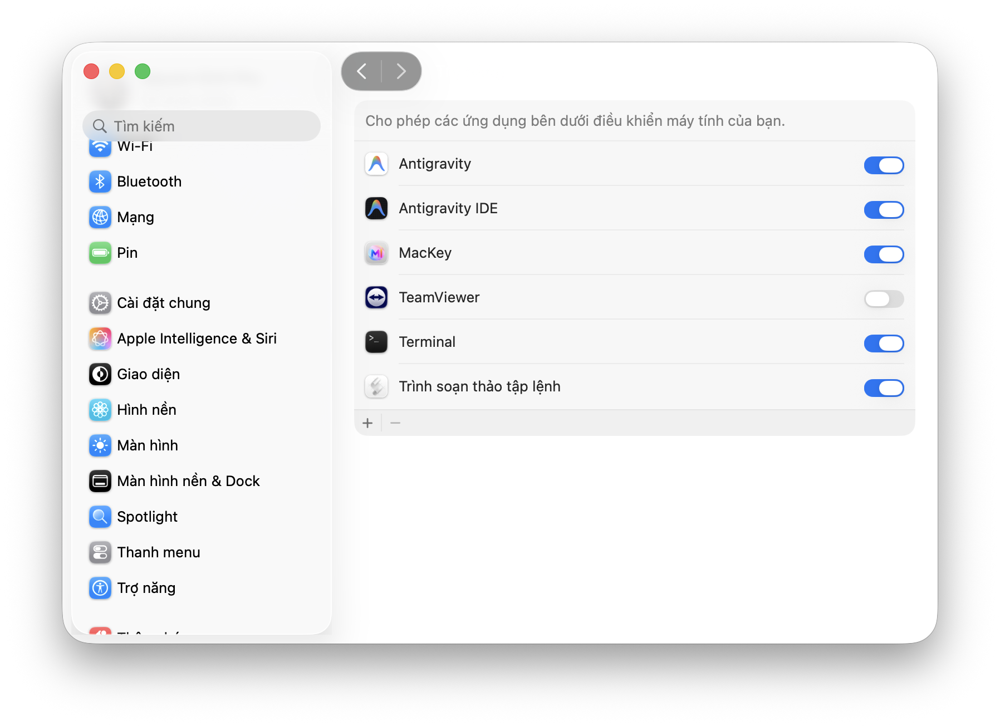
</p>

6. Xác nhận mật khẩu máy hoặc **Touch ID** nếu được yêu cầu.

---

### Bước 4: Bắt đầu gõ tiếng Việt & Tùy chọn phím tắt chuyển chế độ

1. **Kiểm tra trạng thái Menu Bar:** Biểu tượng MacKey hiển thị chữ **V** (Tiếng Việt) hoặc **E** (Tiếng Anh).
2. **Chuyển đổi nhanh chế độ gõ:**
   - **Click chuột:** Nhấp trực tiếp vào biểu tượng trên Menu Bar để đổi giữa `[V]` và `[E]`.
   - **Phím tắt mặc định:** Bấm tổ hợp **`⌥ Option + Z`**.
3. **Tùy chỉnh tổ hợp phím tắt chuyển chế độ:**
   - Click biểu tượng MacKey trên Menu bar ➔ chọn **Bảng điều khiển**.
   - Vào tab **Bộ gõ** ➔ khu vực **Phím chuyển chế độ**.
   - **Phím bổ trợ:** Tích chọn tổ hợp phím mong muốn: `⌃` (Control), `⌥` (Option), `⌘` (Command), `⇧` (Shift).
   - **Phím ký tự:** Click vào ô ký tự và bấm phím bạn muốn gán (ví dụ: `Z`, `Space`...). Nhấn phím **Delete / Backspace** nếu muốn xóa ô này để chỉ dùng 2 phím bổ trợ (như `⌃ Control + ⇧ Shift`).
   - **Âm thanh:** Tích chọn *"Âm thanh"* nếu muốn nghe tiếng bíp nhẹ khi đổi chế độ thành công.
4. **Kiểm tra gõ tiếng Việt:** Mở trình soạn thảo bất kỳ và thử nghiệm gõ phím.

---

## ⌨️ Các kiểu gõ & Bảng mã hỗ trợ

### Kiểu gõ tiếng Việt
| Kiểu gõ | Quy tắc gõ dấu cơ bản |
| :--- | :--- |
| **Telex** | `s`: sắc, `f`: huyền, `r`: hỏi, `x`: ngã, `j`: nặng, `aa` → â, `aw` → ă, `ee` → ê, `oo` → ô, `ow` → ơ, `uw` → ư, `dd` → đ |
| **VNI** | `1`: sắc, `2`: huyền, `3`: hỏi, `4`: ngã, `5`: nặng, `6`: â/ê/ô, `7`: ơ/ư, `8`: ă, `9`: đ |
| **Simple Telex** | Đơn giản hóa các phím tổ hợp phụ âm kép |

### Bảng mã tiếng Việt
* **Unicode dựng sẵn:** Chuẩn quốc tế thông dụng nhất.
* **TCVN3 (ABC):** Sử dụng cho font chữ dạng `.VnTime`, `.VnArial`...
* **VNI Windows:** Sử dụng cho font chữ dạng `VNI-Times`, `VNI-Helve`...
* **Unicode tổ hợp (Compound):** Sử dụng cho một số phần mềm kỹ thuật hoặc hệ thống cũ.
* **Vietnamese Locale CP 1258:** Bảng mã tiếng Việt của Microsoft Windows.

---

## 🔍 Xử lý sự cố thường gặp

| Tình huống | Nguyên nhân | Cách xử lý |
| :--- | :--- | :--- |
| **Gõ chữ không ra dấu tiếng Việt** | Đang ở chế độ Tiếng Anh (icon E). | Click icon trên Menu bar chuyển sang chữ **V**, hoặc bấm phím tắt chuyển chế độ (`⌥ Option + Z`). |
| **Đã bật chữ V nhưng vẫn không gõ được dấu** | Chưa cấp hoặc bị mất quyền Trợ năng. | Vào **Cài đặt hệ thống → Quyền riêng tư & Bảo mật → Trợ năng**, tắt công tắc MacKey rồi bật lại. |
| **Bị nhảy chữ, lặp chữ hoặc mất dấu** | Xung đột với bộ gõ tiếng Việt mặc định của macOS. | Mở **Cài đặt hệ thống → Bàn phím → Nguồn đầu vào (Input Sources)**, xoá bỏ các bộ gõ tiếng Việt mặc định (chỉ giữ lại nguồn *U.S.* hoặc *Tiếng Anh*). |
| **Bộ gõ không tự bật khi khởi động lại máy** | Chưa bật khởi động cùng máy. | Mở Bảng điều khiển MacKey → Tab **Hệ thống** → Bật tùy chọn **Khởi động cùng macOS**. |
| **Mở app bị thông báo tệp bị hỏng hoặc không rõ nguồn gốc** | Gatekeeper chặn ứng dụng tải ngoài App Store. | Click chuột phải vào MacKey trong thư mục `Applications` → chọn **Open**, xem chi tiết tại [Bước 2](#bước-2-mở-ứng-dụng-lần-đầu-vượt-gatekeeper). |

---

## 🗑️ Hướng dẫn gỡ cài đặt sạch sẽ

1. Click biểu tượng MacKey trên Menu bar → chọn **Thoát (Quit)**.
2. Mở thư mục **Applications**, kéo **MacKey.app** vào **Thùng rác (Trash)**.
3. *(Tùy chọn xóa file cấu hình)*:
   - Mở Finder, nhấn tổ hợp `⌘ Command + ⇧ Shift + G` và dán đường dẫn:
     ```bash
     ~/Library/Preferences/com.dinhphu.mackey.plist
     ```
   - Xóa tệp này nếu có.

---

## 📜 Giấy phép & Tác giả

* **Giấy phép:** [GNU General Public License v3.0 (GPLv3)](https://www.gnu.org/licenses/gpl-3.0).
* **Nền tảng mã nguồn gốc:** Kế thừa từ dự án [OpenKey](https://github.com/tuyenvm/OpenKey) của tác giả **Tuyền Mai** và cộng đồng OpenKey.
* **Bản phát triển & Tối ưu hóa:** **DinhPhu** © 2026.
* **Đóng góp & Phản hồi:** Mọi thắc mắc hoặc yêu cầu tính năng, xin vui lòng tạo [Issue trên GitHub](https://github.com/dinhphu-0124/MacKey/issues) hoặc liên hệ qua email: `dinhphuhcmus15@gmail.com`.
